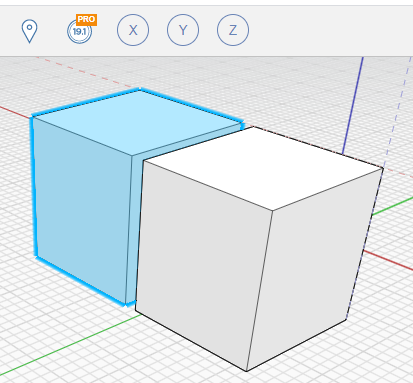

Lumion® LiveSync® for Autodesk® FormIt Pro®
========================

IMPORTANT: Do you need help? Please contact us via our support page: [https://support.lumion.com](https://support.lumion.com)

 

Lumion LiveSync creates a real-time connection between Lumion’s detail-rich, lifelike environments and the most popular 3D modeling and CAD programs. When you model in your CAD software, such as FormIt Pro, AutoCAD or Revit, Lumion immediately visualizes your design choices complete with lighting, atmosphere and other real-life conditions.
 

Now, in Lumion 12, Lumion’s real-time rendering LiveSync plugin is available for Autodesk FormIt Pro, a design tool often used in the early design stages. Autodesk FormIt combines intelligent automation and informed analysis with fluid 3D sketching so architects can design better buildings. By modeling in FormIt and rendering simultaneously in Lumion with the free LiveSync plugin, you’ll always enjoy high-quality visualizations that give invaluable clarity and insight into your design decisions. Always get a real-time view of your 3D FormIt model in Lumion’s breathtaking, full context environments with LiveSync for FormIt Pro.
 

The free Lumion LiveSync plugin lets you set up a simultaneous, real-time connection between your 3D model in FormIt Pro and Lumion 12. Change the model’s shape in FormIt Pro to test a modified design, and you’ll instantly see the model updated in Lumion so you can view it with accurate lighting and shadow, surrounding contexts such as urban neighborhoods or rural settings, and beautiful, realistic materials. 
 

Lumion LiveSync for FormIt Pro includes: 

- Realtime model synchronization between FormIt Pro and Lumion
- Camera synchronization between FormIt Pro and Lumion
- The ability to add and save Lumion’s beautiful materials to your LiveSync project
- Real-time materials synchronization and visualization
- Automatic model importing into Lumion (no need to separately import a model)
- Collada _(*.dae)_ files exporter

[Read more](https://lumion.com/formit-exporters.html)